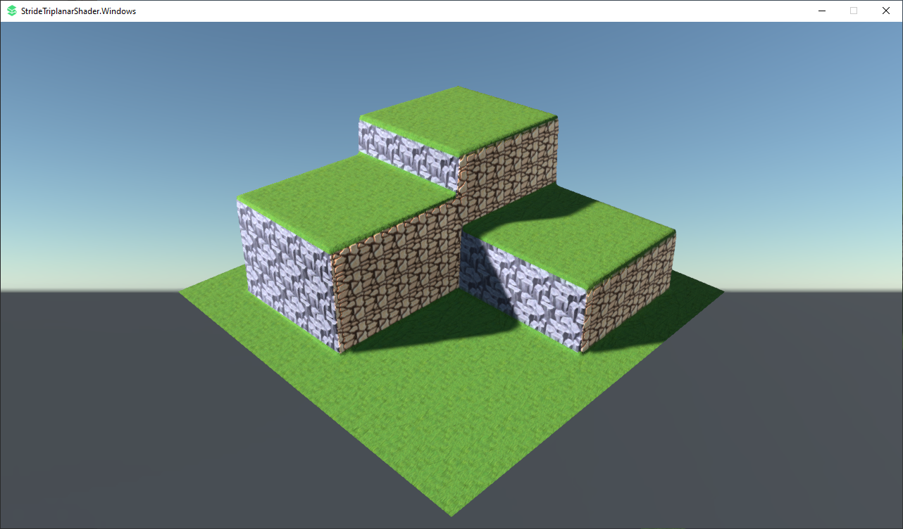

# StrideTriplanarShader
Simple Triplanar Shaders for Stride

This is a simple triplanar set of shaders for Stride inspired by turn-based JRPG games. The textures are from opengameart.org.

1) Clone the project.
2) Explore the blended material.
3) Explore the shader syntax.
4) Use whatever you want. :)

 
